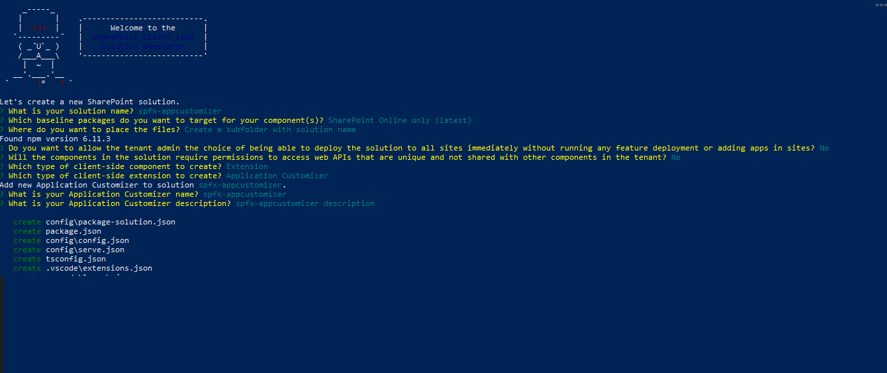

## Extensión spfx-appcustomizer


Pre-requisitos : 

    Dentro de vuestro Tenant en un Site Collection de SharePoint crear una Lista de tipo tareas.


A continuación detallamos los pasos para crear la extensión.


a) Para crear la extensión ejecutamos el siguiente comando : 

    yo @microsoft/sharepoint

        Let's create a new SharePoint solution.
        ? What is your solution name? spfx-appcustomizer
        ? Which baseline packages do you want to target for your component(s)? SharePoint Online only (latest)
        ? Where do you want to place the files? Create a subfolder with solution name
        Found npm version 6.11.3
        ? Do you want to allow the tenant admin the choice of being able to deploy the solution to all sites immediately without running any feature deployment or adding apps in sites? No
        ? Will the components in the solution require permissions to access web APIs that are unique and not shared with other components in the tenant? No
        ? Which type of client-side component to create? Extension
        ? Which type of client-side extension to create? (Use arrow keys)
        > Application Customizer
        Field Customizer
        ListView Command Set



### Building the code

```bash
git clone the repo
npm i
npm i -g gulp
gulp
```

This package produces the following:

* lib/* - intermediate-stage commonjs build artifacts
* dist/* - the bundled script, along with other resources
* deploy/* - all resources which should be uploaded to a CDN.

### Build options

gulp clean - TODO
gulp test - TODO
gulp serve - TODO
gulp bundle - TODO
gulp package-solution - TODO
