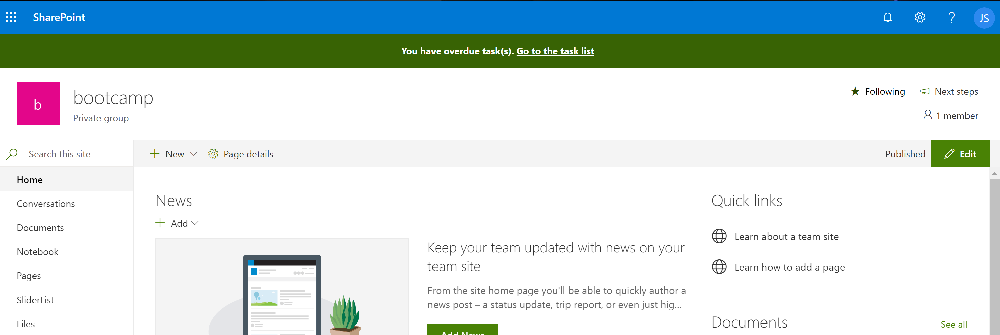

## Extensión spfx-appcustomizer

Vamos a ver como crear una SPFx Extension de tipo Application Customizer, que muestra un mensaje en el placeholder top indicando si tenemos tareas pendientes que han expirado y mostrando un link a la lista de tareas.

### Prerequisitos

Dentro de vuestro Tenant en un Site Collection de SharePoint crear una Lista de tipo tareas.

### Crear Extension

Para crear la extensión ejecutamos el siguiente comando : 

    yo @microsoft/sharepoint

        
    Let's create a new SharePoint solution.
    ? What is your solution name? spfx-appcustomizer
    ? Which baseline packages do you want to target for your component(s)? SharePoint Online only (latest)
    ? Where do you want to place the files? Create a subfolder with solution name
    Found npm version 6.11.3
    ? Do you want to allow the tenant admin the choice of being able to deploy the solution to all sites immediately without running any feature deployment or adding apps in sites? No
    ? Will the components in the solution require permissions to access web APIs that are unique and not shared with other components in the tenant? No
    ? Which type of client-side component to create? Extension
    ? Which type of client-side extension to create? Application Customizer
    Add new Application Customizer to solution spfx-appcustomizer.
    ? What is your Application Customizer name? spfx-appcustomizer
    ? What is your Application Customizer description? spfx-appcustomizer description


Una vez creada la extensión, la abrimos en VS Code y, en el package.json, anadimos pnpjs en dependencies.
```ts
"@pnp/pnpjs": "1.3.7"
```

Abrimos el fichero typescript de la app customizer y usamos pnpjs para recibir, de la lista de tareas, la url de la vista Late Tasks:

```ts
// Get list (task list title property) Late Tasks view and add it to the batch. Construct the view url and assign it to the _viewUrl variable.
pnp.sp.web.lists.getByTitle(this.properties.tasksListTitle).views.getByTitle('Late Tasks').inBatch(batch).get().then((view: any) => {
    this._viewUrl = `${view.ServerRelativeUrl}?FilterField1=AssignedTo&FilterValue1=${escape(this.context.pageContext.user.displayName)}`;
});
```

Y las tareas ya vencidas y no completadas:

```ts
// Get items from the list that belongs to the current logged in user, with past due date and status other than completed. Assign it to the _dueTasks variable.
pnp.sp.web.lists.getByTitle(this.properties.tasksListTitle)
    .items.expand('AssignedTo/Id').select('Title, AssignedTo, AssignedTo/Id, DueDate')
    .filter(`AssignedTo/Id eq ${this.context.pageContext.legacyPageContext.userId} and DueDate lt datetime'${today.toISOString()}' and Status ne 'Completed'`)
    .get().then((items: any) => {
    this._dueTasks = items;
    });
```

Acto seguido, llamamos al metodo renderPlaceHolder, que se encarga de renderizar, si hemos obtenido tareas, el mensaje en el top placeholder:

```ts
@override
  public _renderPlaceholder(): void {

    // Return if there are no due tasks
    if (!this._dueTasks || !this._dueTasks.length) {
      return;
    }

    // If not existing create top placehoder.
    if (!this._topPlaceholder) {
      this._topPlaceholder = this.context.placeholderProvider.tryCreateContent(
        PlaceholderName.Top,
        {
          onDispose: this._onDispose
        });
    }

    // If top placeholder is existing, fill it with the HTML that informs the user that he/she has tasks that have exeeded their due date.
    if (this._topPlaceholder && this._topPlaceholder.domElement) {
      this._topPlaceholder.domElement.innerHTML = `
                <div class="${styles.app}">
                  <div class="ms-bgColor-themeDark ms-fontColor-white ${styles.header}">
                    <i class="ms-Icon ms-Icon--Info" aria-hidden="true"></i> ${escape(strings.Message)}&nbsp;
                    <a href="${this._viewUrl}" target="_blank">${escape(strings.GoToList)}</a>
                  </div>
                </div>`;
    }
  }
```

### Probar Extension

Para probar la extensión debemos completar la url del navegador con lo siguiente : 

?loadSPFX=true&debugManifestsFile=https://localhost:4321/temp/manifests.js&customActions={"CUSTOMACTION":{"location":"ClientSideExtension.ApplicationCustomizer","properties":{"tasksListTitle":"TASKLISTTITLE"}}}

Donde:

a) CUSTOMACTION: Guid de la custom action asociada al command set. Disponible en la carpeta sharepoint->assets->elements.xml->parámetro ClientSideComponentID de la custom action.

b) TASKLISTTITLE: Nombre de la lista de tareas de SPO que hemos creado en los pre-requisitos. Ej: Tasks.
    

Ejemplo:

https://bootcampbcn.sharepoint.com/sites/bootcamp?loadSPFX=true&debugManifestsFile=https://localhost:4321/temp/manifests.js&customActions={"fa597c79-4998-42f5-b973-df97e7e5af71":{"location":"ClientSideExtension.ApplicationCustomizer","properties":{"tasksListTitle":"Tasks"}}}

Una vez aceptamos cargar los scripts de depuracion, al cargar la pagina, si hay items en la lista de tareas que hagan match con nuestra query, se mostrarà el HTML que hemos definido:


