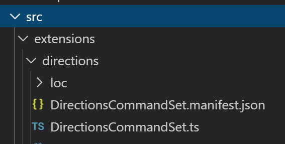

## spfx-command

Vamos a ver como crear y configurar una extension de tipo Command Set que carga una modal dialog con las rutas de Google Maps des de donde nos encontramos al punto establecido en una columna del item seleccionado.

### Prerequisitos

Crear una cuenta en google cloud:

https://console.cloud.google.com/

Crear un nuevo proyecto y habilitar la Maps Embed API


En APIs & Services -> Credentials, crear una nueva API Key y limitarla por http a la URL de vuestro tenant de O365


Guardamos el valor de la API Key, la necesitaremos en nuestro Command Set

En un sitio de SharePoint Online, creamos una nueva lista: Places, por ejemplo. Con dos fields: Title y Address, los dos de tipo Single line of text. Anadimos entradas con Title igual al nombre de un lugar y Address su dirección


### Crear command set

Crear un proyecto de tipo Extension -> ListView Command Set con los siguientes valores:


Una vez creado el proyecto abrirlo en VS Code

En el fichero TypeScript del CommandSet:



Anadimos una Interaface con las propiedades,

```ts
export interface IDirectionsCommandSetProperties {
  startingLocation: string;
  addressColumnName: string;
  title: string;
  message: string;
  mode: string;
  mapsApiKey: string;
}
export default class DirectionsCommandSet extends BaseListViewCommandSet<IDirectionsCommandSetProperties>
```
En el método onExecute vamos a crear un nuevo objeto de tipo HTMLDialog y llamar a su método show()

```ts
@override
  public onExecute(event: IListViewCommandSetExecuteEventParameters): void {
    new HtmlDialog(this.properties.title, `${this.properties.message} ${event.selectedRows[0].getValueByName('Title')}`,
    `<iframe width="600" height="450" frameborder="0" style="border:0"
src="https://www.google.com/maps/embed/v1/directions?origin=${encodeURIComponent(this.properties.startingLocation)}&destination=${encodeURIComponent(event.selectedRows[0].getValueByName(this.properties.addressColumnName))}&mode=${this.properties.mode}&key=${this.properties.mapsApiKey}" allowfullscreen></iframe>`, 'Close').show();
  }
```

Tenemos que crear un nuevo fichero en la misma carpeta de la extension, HtmlDialog.tsx, donde vamos a usar office-ui-fabric-react para generar el Dialog. 

Creamos primero la clase que extiende del base dialog de SPFx dialog framework:

```ts
import { BaseDialog, IDialogConfiguration } from '@microsoft/sp-dialog';
export default class HtmlPickerDialog extends BaseDialog {
  constructor(private dialogTitle: string, private dialogMessage: string, private html: string, private closeButtonText: string) {
      super();
  }

  public render(): void {
    ReactDOM.render(<HtmlDialogContent
      title={ this.dialogTitle }
      message={ this.dialogMessage }
      html={ this.html }
      closeText={ this.closeButtonText }
      close={ this.close }
    />, this.domElement);
  }

  public getConfig(): IDialogConfiguration {
    return {
      isBlocking: true
    };
  }
}
```

Luego definimos la clase HtmlDialogContent, que usa office-ui-fabric-react para renderizar el contenido del dialog

```ts
import {
  PrimaryButton,
  DialogFooter,
  DialogContent
} from 'office-ui-fabric-react';
interface IHtmlDialogContentProps {
  title: string;
  message: string;
  html: string;
  closeText: string;
  close: () => void;
}

class HtmlDialogContent extends React.Component<IHtmlDialogContentProps, {}> {
  constructor(props) {
    super(props);
  }

  public render(): JSX.Element {
    return <DialogContent
      title={this.props.title}
      subText={this.props.message}
      onDismiss={this.props.close}
      showCloseButton={true}
    >
      <div dangerouslySetInnerHTML={{__html: this.props.html}} />
      <DialogFooter>
        <PrimaryButton text={this.props.closeText} title={this.props.closeText} onClick={() => { this.props.close(); }} />
      </DialogFooter>
    </DialogContent>;
  }
}
```

Una vez el codigo está listo, para ejecutarlo:

```ps
gulp serve --nobrowser
```

Abrimos la lista que hemos creado como prerequisito en SPO y anadimos al final de su url:

?loadSPFX=true&debugManifestsFile=https://localhost:4321/temp/manifests.js&customActions={"CUSTOMACTION":{"location":"ClientSideExtension.ListViewCommandSet.CommandBar","properties":{"startingLocation":"Carrer del Triangle, 1, 4, 08002 Barcelona","addressColumnName":"ADDRESSCOLUMN","title":"Driving directions","message":"Driving directions to ","mode":"driving","mapsApiKey":"MAPSAPIKEY"}}}

Donde:
    a) CUSTOMACTION: Guid de la custom action asociada al command set. Disponible en la carpeta sharepoint->assets->elements.xml->parámetro ClientSideComponentID de la custom action.
    b) ADDRESSCOLUMN: Nombre de la columna de la lista de SPO que hemos creado en los pre-requisitos. Ej: Address.
    c) MAPSAPIKEY: Key de la API de Google Cloud que hemos creado en los pre-requisitos.

Ejemplo:

https://bootcampbcn.sharepoint.com/sites/bootcamp/Lists/Places/AllItems.aspx?loadSPFX=true&debugManifestsFile=https://localhost:4321/temp/manifests.js&customActions={"5d5b6ea5-e481-4a42-9b18-89ba98905195":{"location":"ClientSideExtension.ListViewCommandSet.CommandBar","properties":{"startingLocation":"Carrer del Triangle, 1, 4, 08002 Barcelona","addressColumnName":"Address","title":"Driving directions","message":"Driving directions to ","mode":"driving","mapsApiKey":"*******************************"}}}

Una vez aceptamos cargar los scripts de depuracion, al seleccionar un item de la lista, aparece el command set y, al abrirlo, el dialog con las indicaciones de Google Maps:

