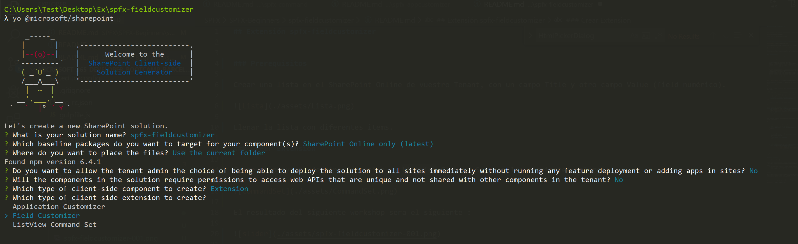

## Extensión spfx-fieldcustomizer

Vamos a ver como crear una SPFx Extension de tipo Field Customizer usando React, que modifica el render de un field numérico para mostrarlo con un slide, guardando el valor en el campo correspondiente.

### Prerequisitos

Crear una lista en el SharePoint Online de vuestro Tenant, con un campo Title y otro campo Value (field numérico).


Llenar la lista con diferentes items.

### Crear Extension

Crear un proyecto de tipo Extension -> Field Customizer Set con los siguientes valores:



Una vez creado, abrimos el proyecto con VS Code y modificamos el fichero Typescript del field customizer, mas especificament el RenderCell, donde miramos si el usuario acutal tiene edit list item permissions y creamos un elemento de tipo BSliderField, pasandole sus argumentos, incluido el evento onSliderValueChange

```ts
@override
  public onRenderCell(event: IFieldCustomizerCellEventParameters): void {
    // Use this method to perform your custom cell rendering.
    const value: string = event.fieldValue;
    const id: string = event.listItem.getValueByName('ID').toString();
    const hasPermissions: boolean = this.context.pageContext.list.permissions.hasPermission(SPPermission.editListItems);


    const slider: React.ReactElement<{}> =
      React.createElement(BSliderField, { value: value, id: id, disabled: !hasPermissions, onChange: this.onSliderValueChanged.bind(this) } as IBSliderFieldProps);

    ReactDOM.render(slider, event.domElement);
  }
```

Creamos el metodo onSliderValueChanged, que usa pnpjs para actualizar el valor en SPO.

```ts
private onSliderValueChanged(value: number, id: string): void {
    if (this._timerId !== -1)
      clearTimeout(this._timerId);

    this._timerId = setTimeout(() => {
      let updateObj: any = {};
      updateObj[this.context.field.internalName] = value;
      pnp.sp.web.lists.getByTitle(this.context.pageContext.list.title).items.getById(parseInt(id))
        .update(updateObj)
        .then((result: ItemUpdateResult): void => {
          console.log(`Item with ID: ${id} successfully updated`);
        }, (error: any): void => {
          console.log('Loading latest item failed with error: ' + error);
        });
    }, 1000);
  }
```

Ahora tenemos que crear el componente de React BSliderField. Lo haremos dentro de la carpeta components. Este componente es el que serà renderizado dentro de la cell.

Para hacerlo, usaremos office-ui-fabric-react:

```ts
import { Slider as ReactSlider } from 'office-ui-fabric-react';
```

En el render, renderizamos el Slider:

```ts
<div className={styles.cell}>
    {this.state.value &&
    (
        <ReactSlider
        value={this.state.value}
        max={100}
        onChange={this.onChange.bind(this)}
        disabled={this.props.disabled} />
    )}
</div>
```

Creamos también el metodo this.onChange, que llama simplemente a la prop onChange que le ha pasado el Field Customizer:

```ts
private onChange(value: number): void {
    if (this.props.onChange)
      this.props.onChange(value, this.props.id);
  }
```

### Probar Extension

Para probar la extensión vamos a abir el fichero serve.json dentro de la carpeta config. 

```ts
{
  "$schema": "https://developer.microsoft.com/json-schemas/core-build/serve.schema.json",
  "port": 4321,
  "https": true,
  "serveConfigurations": {
    "default": {
      "pageUrl": "https://bootcampbcn.sharepoint.com/sites/bootcamp/Lists/SliderList/AllItems.aspx",
      "fieldCustomizers": {
        "Value": {
          "id": "d77148f4-0050-405c-88d5-1b09ee923fe4",
          "properties": {
          }
        }
      }
    },
    "bSliderField": {
      "pageUrl": "https://bootcampbcn.sharepoint.com/sites/bootcamp/Lists/SliderList/AllItems.aspx",
      "fieldCustomizers": {
        "Value": {
          "id": "d77148f4-0050-405c-88d5-1b09ee923fe4",
          "properties": {
          }
        }
      }
    }
  }
}
```

Modificamos dos parametros: 

  1) pageUrl : Url completa a la lista que hemos creado en los prerequisitos
  2) id: corresponde al guid del field, que podemos encontrar en la carpeta sharepoint -> assets -> elements.xml -> ClientSideComponentId.

En una consola, dentro de la carpeta del proyecto, ejecutamos
```
gulp serve
```

Como resultado, se abrira un navegador con el link establecido y, después de cargar los ficheros de depuración, mostrará el field customizer en la columna numerica que hemos establecido 

