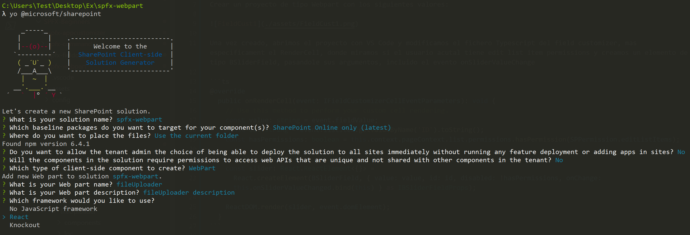
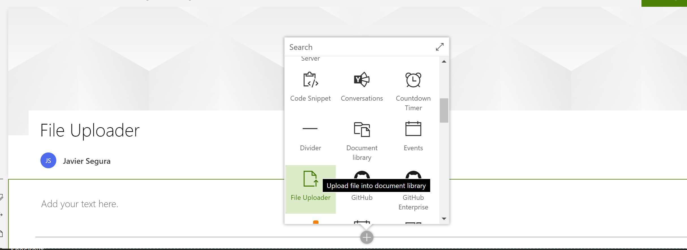
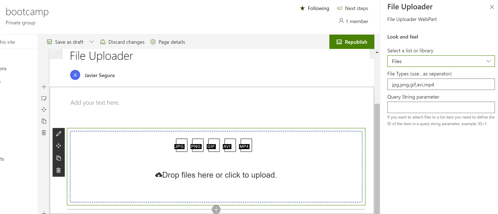

## SPFx Webpart

Vamos a ver como crear una Webpart SPFx con React que permita la carga de ficheros de imagenes en diferentes formatos en una document library especificada en las propiedades de la webpart.

### Crear Webpart

Crear un proyecto de tipo Webpart con los siguientes valores:



Una vez creado, abrimos el proyecto con VS Code y tenemos que crear:

1) SPListPickeService: Implementacion del servicio para leer listas y items de un SPO Site

2) PropertyFieldHeader: Muestra el Label y el Callout

3) Property Fields: Field de error y de list picker

4) FileUploaderComponent: Usa el componente 'react-dropzone-component' para habilitar el drag and drop de ficheros y sus respectivos eventos, que a su vez usan pnpjs para operar con SPO.

5) FileUploaderWebpart: Implementa el panel de las propiedades de la webpart (PropertyPane) y, en el render, llama al FileUploaderComponent.

### Probar Extension

Para probar la extensión, ejecutamos en la consola:

```ps
gulp serve --nobrowser
```

Creamos una nueva pagina o editamos una pagina existente en SPO anadiendo al final de la URL los siguientes parametros:

?loadSPFX=true&debugManifestsFile=https://localhost:4321/temp/manifests.js

En edit mode, podemos anadir la webpart:



Modificar sus propiedades:



Al publicar la página, podemos ya subir imagenes a la document library elegida.
