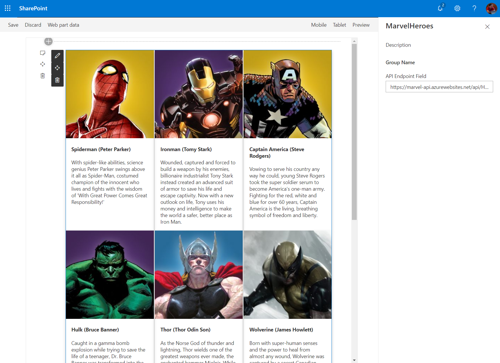
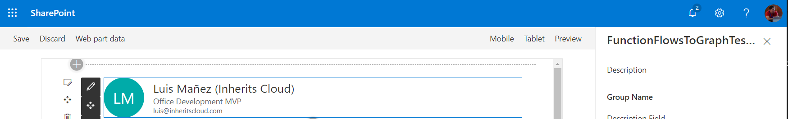
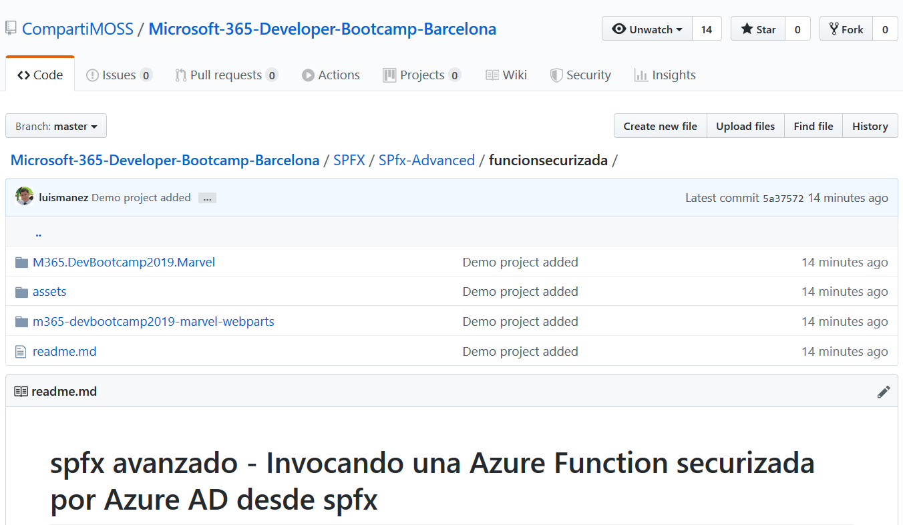
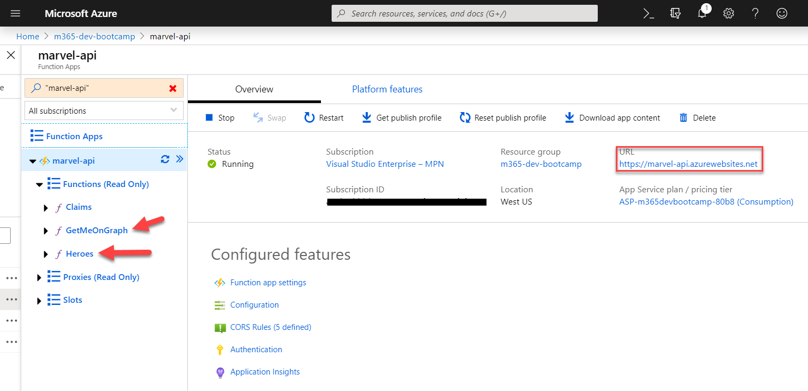
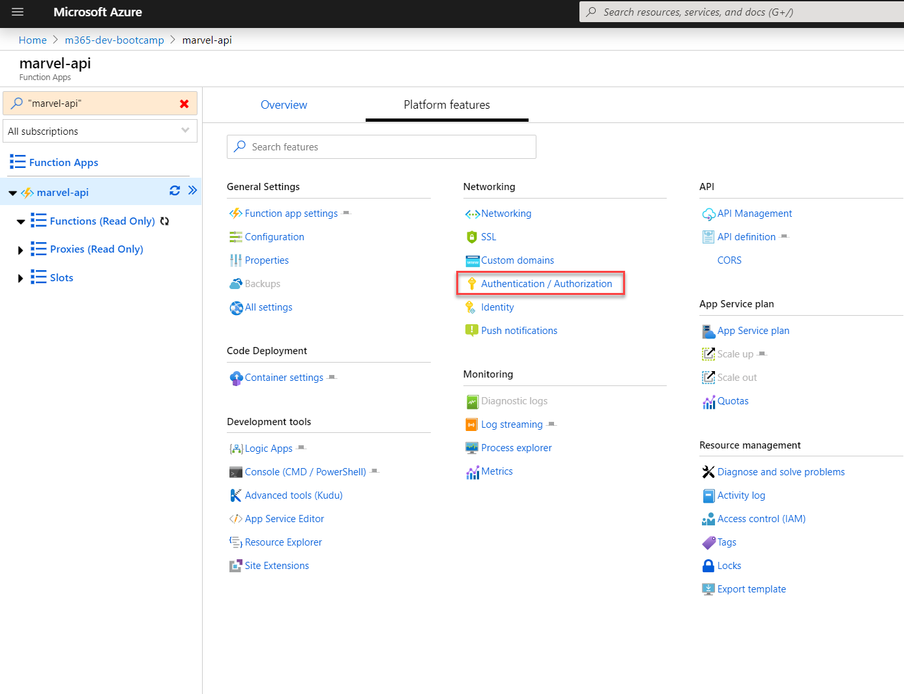
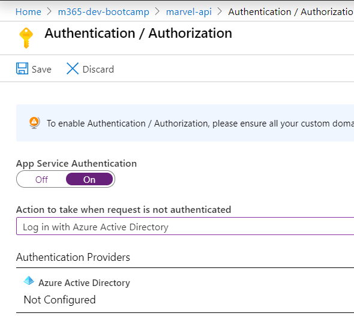
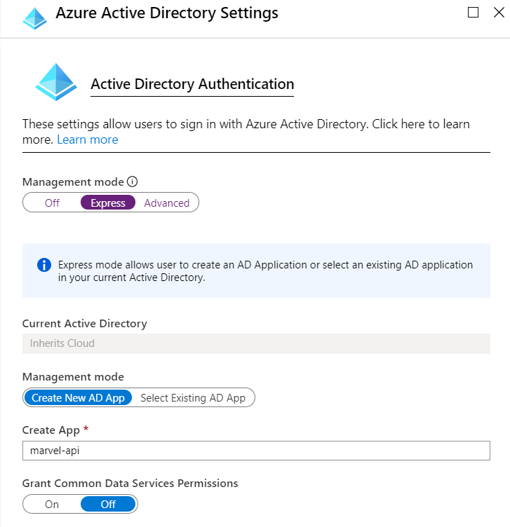
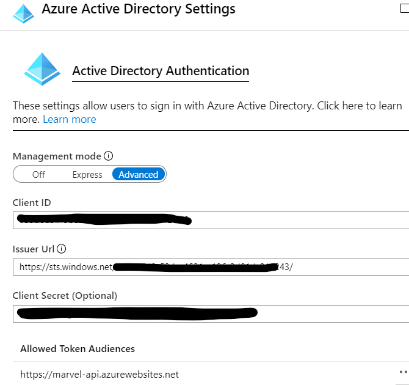

# spfx avanzado - Invocando una Azure Function securizada por Azure AD desde spfx

En este lab, vamos a ver como podemos crear una __Azure Function__, y securizarla con __Azure Active Directory__ (AAD) fácilmente, usando el asistente del propio portal de Azure, para luego consumir dicha función desde un webpart de _spfx_. Además, también veremos como hacer un "segundo salto", y desde la Función de Azure, consumir la __MS Graph API__ con el contexto del usuario logado en SharePoint. Para esto último, haremos uso del "On Behalf Of" flow de oAuth2, y nos ayudará la librería _MSAL_ (Microsoft Authentication Library).

Para facilitar la consecución del lab, partiremos de un proyecto base, donde ya tenemos preparadas algunas cosas básicas de "scaffolding", y otros puntos que no aportan mucho a la temática del lab.

Para este lab son necesarios los siguiente pre-requisitos:
- Visual Studio 2017 o superior
- Visual Studio Code
- Cliente de Git instalado
- Disponer de una tenant de Office 365. Puedes conseguir una tenant de desarrollo desde el siguiente enlace: [https://developer.microsoft.com/en-us/office/dev-program#Subscription](https://developer.microsoft.com/en-us/office/dev-program#Subscription)
- Disponer de una Subscripción de Azure. Puedes conseguir una subscripción de 30 días gratis en el siguiente enlace: [https://azure.microsoft.com/en-us/free/](https://azure.microsoft.com/en-us/free/)
- Idealmente, la subscripción de Azure debe estar vinculada a la tenant de Office 365. Si partes de cero, primero obtén tu Tenant de desarrollo de Office 365, y luego puedes seguir los pasos de este enlace para obtener la subscripción de Azure vinculada a la tenant de Office 365: [https://docs.microsoft.com/en-us/azure/billing/billing-use-existing-office-365-account-azure-subscription](https://docs.microsoft.com/en-us/azure/billing/billing-use-existing-office-365-account-azure-subscription)
- Si ya tienes una tenant y una subscripción por separado, puedes seguir los pasos de este video para vincularlas: [https://channel9.msdn.com/Series/Microsoft-Azure-Tutorials/Associate-an-Office-365-tenant-with-an-Azure-subscription](https://channel9.msdn.com/Series/Microsoft-Azure-Tutorials/Associate-an-Office-365-tenant-with-an-Azure-subscription)
- Si todavía no has desarrollado con Spfx, o acabas de crear tu Tenant de Office 365, asegúrate de que has seguido todos los pasos de este artículo: [https://docs.microsoft.com/en-us/sharepoint/dev/spfx/set-up-your-development-environment](https://docs.microsoft.com/en-us/sharepoint/dev/spfx/set-up-your-development-environment)

Estos son los puntos principales del lab:
- Clonar el proyecto base
- Publicar la Azure Function en la subscripción Azure
- Añadir varias App Settings a la Function
- Securizar la Function con AAD usando el asistente del propio portal
- Habilitar CORS en nuestra Function
- Configurar un _service principal_ en SharePoint
- Completar algunos métodos del webpart spfx
- Actualizar el código de la Function para consumir MS Graph API
- Test de todo usando el Workbench de SharePoint Online

Si todo ha ido bien, en el _workbench_ de SPO podremos añadir un par de webparts, el primero, llamado _MarvelHeroes_, cargará un listado de varios super héroes (los datos vienen de la Azure Function, y están securizados usando AAD):



El segundo webpart disponible, llamado _FunctionFlowsToGraphTester_, mostrará información del usuario logado, obtenida de la MS Graph API (a través del ME endpoint: https://graph.microsoft.com/v1.0/me):



## Clonar proyecto base

Tenéis todos los laboratorios del evento en el siguiente repositorio de GitHub

```ps
git clone https://github.com/CompartiMOSS/Microsoft-365-Developer-Bootcamp-Barcelona.git
```

Este lab lo podéis encontrar en la ruta:

__...SPFX/SPfx-Advanced/funcionsecurizada/__



En dicho folder hay 2 carpetas principales:
- Azure Function: Esta Function se comporta como una API, y expone un método que nos va a devolver un listado de super-héroes, y otro método que llamará a MS Graph API para obtener información del usuario logado. Inicialmente, no todo el código de la Function está hecho. Más adelante modificaremos este proyecto para añadirle otra función/endpoint
- spfx webparts project: este proyecto contiene dos webparts que harán uso de la Function

## Publicar la Function a Azure

Nuestro siguiente paso será publicar la Azure Function, para ello podemos utilizar Visual Studio. Podemos crear la Function App primero desde el portal, o dejar que Visual Studio la cree por nosotros. Si no sabes cómo publicar una Function desde Visual Studio, este enlace te explica cómo hacerlo: [https://docs.microsoft.com/en-us/azure/azure-functions/functions-develop-vs#publish-to-azure](https://docs.microsoft.com/en-us/azure/azure-functions/functions-develop-vs#publish-to-azure)

Una vez publicado, tu Function App debe parecerse a esto:



Guarda la URL, ya que la necesitaremos más tarde. En este punto, las funciones son anónimas, pero sólo la función _Heroes_ funcionará con acceso anónimo, ya que las otras dos necesitan el contexto de un usuario logado. Si quieres puesde poner la URL de la función _Heroes_ en un browser (o mejor en [Postman](https://www.getpostman.com/)), y obtendrás un JSON con un listado de súper héroes.

## Securizar la Function App con Azure AD

Ahora es momento de añadir seguridad a nuestra Function App. Para ello usaremos el propio portal de Azure y su asistente para securizar Function Apps.

Primero, pinchamos en el enlace de: _Authentication / Authorization_



Ahora habilitamos la _Authentication_, y seleccionamos Azure AD



Pasamos a confiurar el _Authentication Provider_ de Azure AD, seleccionamos la opción _Express_, y dejamos que cree una nueva App de Azure AD

__Nota__: Para la configuración Express, es necesario que la suscripción de Azure esté en la misma Tenant de Office 365. Si no es el caso, tendrás que configurar la Avanzada. Aquí tienes detalle de cómo hacerlo: [https://docs.microsoft.com/en-us/azure/app-service/configure-authentication-provider-aad#-configure-with-advanced-settings](https://docs.microsoft.com/en-us/azure/app-service/configure-authentication-provider-aad#-configure-with-advanced-settings)



Una vez la configuración express ha sido aplicada, volvemos al mismo sitio, pero en este caso seleccionamos el modo _Advanced_, ya que necesitamos tunear algunas de las cosas que ha configurado el _express mode_

Primero, copia y guarda a buen recaudo el _Client Id_ y _Client Secret_ generados. Ahora, añade la URL de la Function App (recuerda que te dije que la copiaras antes? :), si no lo hiciste, vuelve a la Function App y hazte con esa URL), a la lista de __Allowed Token Audiences__



__Nota__: Asegúrate de que guardas los cambios. Hay un botón __Save__ en la _blade_ anterior.

Una vez finalizados estos pasos, nuestra Function App ya estará securizada por Azure AD, así que ya no podremos llamar a ninguna de las Funciones, sin proporcionar un Token válido. De cómo se obtiene dicho Token, lo veremos en la parte de los webparts de spfx, pero la mayor parte de la magia nos la facilitará el propio spfx framework!