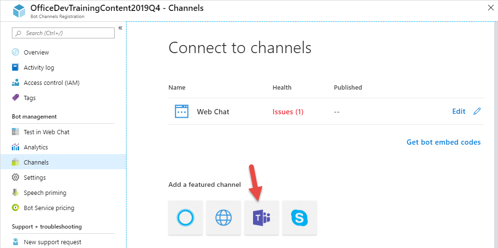
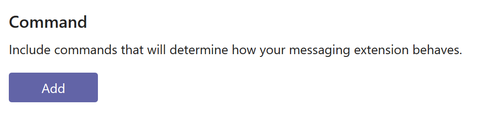

## Crear solución Visual Studio
    Esta solución requiere Bot Framework v4 SDK https://marketplace.visualstudio.com/items?itemName=BotBuilder.botbuilderv4
1. Abre Visual Studio
2. Crea un nuevo proyecto utilizando la plantilla Empty Bot(Bot Framework v4)
    imagen
1. Añade una nueva carpeta Data al proyecto
2. Dentro de la carpeta Data añade un nuevo fichero json, llamado avengers.json
3. Abre el fichero avengers.json y copia esta información

```
{
  "characters": [
    {
      "name": "Iron Man",
      "actor": "Robert Downey, Jr.",
      "realname": "Tony Stark",
      "image": "https://terrigen-cdn-dev.marvel.com/content/prod/1x/002irm_ons_crd_03.jpg",
      "link": "https://www.marvel.com/characters/iron-man-tony-stark"
    },
    {
      "name": "Captain America",
      "actor": "Chris Evans",
      "realname": "Steve Rogers",
      "image": "https://terrigen-cdn-dev.marvel.com/content/prod/1x/003cap_ons_crd_03.jpg",
      "link": "https://www.marvel.com/characters/captain-america-steve-rogers"
    },
    {
      "name": "Hulk",
      "actor": "Mark Ruffalo, Edward Norton",
      "realname": "Bruce Banner",
      "image": "https://terrigen-cdn-dev.marvel.com/content/prod/1x/006hbb_ons_crd_03.jpg",
      "link": "https://www.marvel.com/characters/hulk-bruce-banner"
    },
    {
      "name": "Thor",
      "actor": "Chris Hemsworth",
      "realname": "Thor Odinson",
      "image": "https://terrigen-cdn-dev.marvel.com/content/prod/1x/004tho_ons_crd_03.jpg",
      "link": "https://www.marvel.com/characters/thor-thor-odinson"
    },
    {
      "name": "Black Widow",
      "actor": "Scarlett Johansson",
      "realname": "Natasha Romanoff",
      "image": "https://terrigen-cdn-dev.marvel.com/content/prod/1x/011blw_ons_crd_03.jpg",
      "link": "https://www.marvel.com/characters/black-widow-natasha-romanoff"
    },
    {
      "name": "Hawkeye",
      "actor": "Jeremy Renner",
      "realname": "Clint Barton",
      "image": "https://terrigen-cdn-dev.marvel.com/content/prod/1x/018hcb_ons_crd_02.jpg",
      "link": "https://www.marvel.com/characters/hawkeye-clint-barton"
    }
  ]
```
4. Abre el fichero EmptyBot1.cs
5. Añade los siguientes usings
    ```
    using Microsoft.Bot.Builder.Teams;
    using Microsoft.Bot.Schema.Teams;
    using System.Linq;
    using System.Net.Http;
    using Newtonsoft.Json.Linq;
    using System;
    using System.IO;

     
6. Elimina el método OnMembersAddedAsync
7. Crea el siguiente método para consultar los vengadores disponibles
``` 
   protected override async Task<MessagingExtensionResponse> OnTeamsMessagingExtensionQueryAsync(ITurnContext<IInvokeActivity> turnContext, MessagingExtensionQuery query, CancellationToken cancellationToken)
        {
            var text = string.Empty;
            if (query.Parameters[0].Name.Equals("queryText"))
                text = query?.Parameters?[0]?.Value as string ?? string.Empty;


            var avengers = await FindAvengers(text);

            // We take every row of the results and wrap them in cards wrapped in in MessagingExtensionAttachment objects.
            // The Preview is optional, if it includes a Tap, that will trigger the OnTeamsMessagingExtensionSelectItemAsync event back on this bot.
            var attachments = avengers.Select(avenger =>
            {
                var previewCard = new ThumbnailCard { Title = avenger.Item1, Tap = new CardAction { Type = "invoke", Value = avenger } };
                if (!string.IsNullOrEmpty(avenger.Item5))
                {
                    previewCard.Images = new List<CardImage>() { new CardImage(avenger.Item4, "Icon") };
                }

                var attachment = new MessagingExtensionAttachment
                {
                    ContentType = HeroCard.ContentType,
                    Content = new HeroCard { Title = avenger.Item1 },
                    Preview = previewCard.ToAttachment()
                };

                return attachment;
            }).ToList();

            // The list of MessagingExtensionAttachments must we wrapped in a MessagingExtensionResult wrapped in a MessagingExtensionResponse.
            return new MessagingExtensionResponse
            {
                ComposeExtension = new MessagingExtensionResult
                {
                    Type = "result",
                    AttachmentLayout = "list",
                    Attachments = attachments
                }
            };
        }
```
8. Añade el siguiente método que se ejecutará al seleccionar un vengador de la lista

```
protected override Task<MessagingExtensionResponse> OnTeamsMessagingExtensionSelectItemAsync(ITurnContext<IInvokeActivity> turnContext, JObject query, CancellationToken cancellationToken)
        {
            // The Preview card's Tap should have a Value property assigned, this will be returned to the bot in this event. 
            var (name, actor, realname, image, link) = query.ToObject<(string, string, string, string, string)>();

            // We take every row of the results and wrap them in cards wrapped in in MessagingExtensionAttachment objects.
            // The Preview is optional, if it includes a Tap, that will trigger the OnTeamsMessagingExtensionSelectItemAsync event back on this bot.
            var card = new ThumbnailCard
            {
                Title = name,
                Subtitle = $"{actor}, {realname}",
                Buttons = new List<CardAction>
                    {
                        new CardAction { Type = ActionTypes.OpenUrl, Title = "Marvel Profile", Value = link },
                    },
            };

            if (!string.IsNullOrEmpty(image))
            {
                card.Images = new List<CardImage>() { new CardImage(image, "Icon") };
            }

            var attachment = new MessagingExtensionAttachment
            {
                ContentType = ThumbnailCard.ContentType,
                Content = card,
            };

            return Task.FromResult(new MessagingExtensionResponse
            {
                ComposeExtension = new MessagingExtensionResult
                {
                    Type = "result",
                    AttachmentLayout = "list",
                    Attachments = new List<MessagingExtensionAttachment> { attachment }
                }
            });
        }
```
1. crea el siguiente método que leerá los datos del fichero json que hemos creado

```
private async Task<IEnumerable<(string, string, string, string, string)>> FindAvengers(string text)
        {
            try
            {
                var data = File.ReadAllText(@".\data\avengers.json");
                var obj = JObject.Parse(data);
                return obj["characters"]
                    .Where(item => item["name"].ToString().Contains(text, StringComparison.InvariantCultureIgnoreCase))
                    .Select(item => (item["name"].ToString(), item["actor"].ToString(), item["realname"].ToString(), item["image"]?.ToString(), item["link"].ToString()));
            }
            catch (Exception ex)
            {

                throw;
            }
        }
``` 
1. Crea el siguiente metodo para controlar las acciones
```
protected override async Task<MessagingExtensionActionResponse> OnTeamsMessagingExtensionSubmitActionAsync(ITurnContext<IInvokeActivity> turnContext, MessagingExtensionAction action, CancellationToken cancellationToken)
        {
            switch (action.CommandId)
            {
                // These commandIds are defined in the Teams App Manifest.
                case "CreateAvenger":
                    return CreateAvengerCommand(turnContext, action);

                default:
                    throw new NotImplementedException($"Invalid CommandId: {action.CommandId}");
            }
        }
```
1. Crea el siguiente método
```
private MessagingExtensionActionResponse CreateAvengerCommand(ITurnContext<IInvokeActivity> turnContext, MessagingExtensionAction action)
        {
            // The user has chosen to create a card by choosing the 'Create Card' context menu command.
            var createCardData = ((JObject)action.Data).ToObject<CreateCardData>();

            var card = new HeroCard
            {
                Title = createCardData.Name,
                Subtitle = createCardData.Actor,
                Images = new List<CardImage>
                {
                    new CardImage { Url = "https://res.cloudinary.com/teepublic/image/private/s--s0r6TuRK--/c_crop,x_10,y_10/c_fit,h_995/c_crop,g_north_west,h_1260,w_1008,x_-157,y_-192/co_rgb:0c3052,e_colorize,u_Misc:One%20Pixel%20Gray/c_scale,g_north_west,h_1260,w_1008/fl_layer_apply,g_north_west,x_-157,y_-192/bo_126px_solid_white/e_overlay,fl_layer_apply,h_1260,l_Misc:Art%20Print%20Bumpmap,w_1008/e_shadow,x_6,y_6/c_limit,h_1134,w_1134/c_lpad,g_center,h_1260,w_1260/b_rgb:eeeeee/c_limit,f_jpg,h_630,q_90,w_630/v1481201499/production/designs/923008_1.jpg" },
                }
            };

            var attachments = new List<MessagingExtensionAttachment>();
            attachments.Add(new MessagingExtensionAttachment
            {
                Content = card,
                ContentType = HeroCard.ContentType,
                Preview = card.ToAttachment(),
            });

            return new MessagingExtensionActionResponse
            {
                ComposeExtension = new MessagingExtensionResult
                {
                    AttachmentLayout = "list",
                    Type = "result",
                    Attachments = attachments,
                },
            };
        } 
```
2. Dentro del fichero EmptyBot1 Crea una nueva clase para almacenar los datos del nuevo vengador
```
class CreateCardData
    {
        public string Name { get; set; }

        public string Actor { get; set; }

        public string Image { get; set; }
    }
```
2. Abre el fichero appsettings.json y añade tu ClientId y ClientSecret


## Ejecutar la aplicación ngrok secure tunnel
1. Abre una nueva ventana del símbolo del sistema.

2. Cambia al directorio que contiene la aplicación ngrok.exe.

3. Ejecute el siguiente comando reemplazando [port] con el puerto de la URL de la aplicación.

    ```code 
    ngrok http[port] -host-header=localhost:[port] 
    ```

    


4. La aplicación ngrok mostrará en la consola información. Tome nota de la dirección de reenvío utilizando https. Esta dirección es necesaria en el siguiente paso.

5. Minimizar la ventana de la línea de comandos de ngrok. Ya no está referenciado en este laboratorio, pero debe seguir funcionando.

## Registrar el bot

1. Abre el [Azure Portal](https://portal.azure.com).

1. Seleccione Crear un recurso.

1. En el cuadro Buscar en el mercado, introduzca bot.

1. Elija Registro de Canales de Bot

1. Seleccione el pulsador Crear.

1. Completa la hoja de Registro de Canales de Bot. Para el nombre del Bot, introduzca un nombre descriptivo.

1. Introduzca la siguiente dirección para el punto final de Mensajería. Sustituya el token[dengrok] por la dirección de reenvío que se muestra en la ventana ngrok.
    ```
    https://[from-ngrok].ngrok.io/api/Messages
    ```
1. Permite que el servicio cree automáticamente una aplicación.

1. Seleccione Crear.

1. Cuando finalice la implementación, navegue hasta el recurso en el portal de Azure. En la parte izquierda de la navegación, seleccione Todos los recursos. En la pestaña Todos los recursos, seleccione el Registro de Canales Bot.

1. En la sección Administración de bots, seleccione Canales.
    

1. Haga clic en el logotipo de Microsoft Teams para crear una conexión con Teams. Seleccione Guardar. Acepta los Términos de Servicio.
    

1. En la pestaña de Registro de Canales Bot, seleccione Configuración en Administración de Bots.
     

1. Se muestra el Id. de la aplicación de Microsoft. Copia este valor.

1. Junto al Id. de aplicación de Microsoft, seleccione el enlace Administrar. Esto le llevará a la hoja de registro de la aplicación.

1. En la hoja de aplicación, seleccione Certificados y secretos.

1. Seleccione Nuevo secreto de cliente.

1. Introduzca una descripción y seleccione un intervalo de caducidad. Seleccione Añadir.

1. Se crea y muestra un nuevo secreto. Graba el nuevo secreto.
    

1. Una vez que tengamos el clientId y clientSecret lo añadimos en nuestro proyecto de Visual Studio dentro del fichero appsettings.json
```
{
  "MicrosoftAppId": "[clientId]",
  "MicrosoftAppPassword": "[clientSecret]"
}
```
## Crear la aplicación de Microsoft Teams en App Studio
1. Dentro de Microsoft Teams pulsamos en los puntos suspensivos y seleccionamos App Studio
    
1. Pulsamos sobre Manifest Editor y Create a new app
    
1. En la pestaña App Details añadimos los datos que queramos para nuestra app
    
1. Vamos a la pestaña Messaging extensions y pulsamos sobre Set up
    
1. En la ventana que aparece pulsamos sobre usar un bot existente , seleccionamos el bot que hemos creado anteriormente de la lista y le ponemos un nombre
    
1. En la siguiente ventana vamos a la sección Command y añadimos uno nuevo
    
1. Seleccionamos la primera opción, que indica que es nuestra extensión va a realizar una búsqueda
    
1. Añadimos los siguientes valores 
    
1. Ahora vamos a añadir un parámetro
    
1.  Ahora vamos a añadir otro comando. Pulsamos sobre añadir comando y seleccionamos la segunda opción
    
2.  En la siguiente ventana seleccionamos que va a tener un conjunto estático de paramentros
    
3.  Añadimos el primero parámetro con los siguientes datos
    
4.  Repetimos el paso anterior para añadir dos parámetros más
    
    
5.  Una vez configurado, podemos desplegarlo directamente desde App Studio. Para ello vamos a la pestaña Test and distribute
    
6.  Dentro de esta pestaña podemos instalar nuestra aplicación, descargar el manifiesto o enviarla a aprobación para incluirla dentro del store de Teams. Nosotros pulsaremos sobre Install
    
7.  En la siguiente pestaña pulsamos sobre agregar.
    