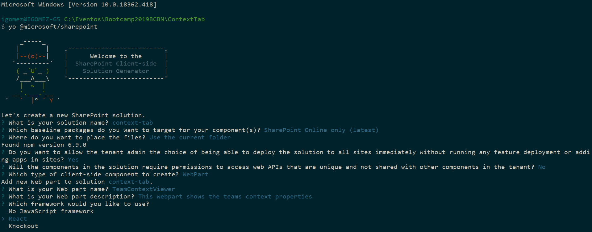
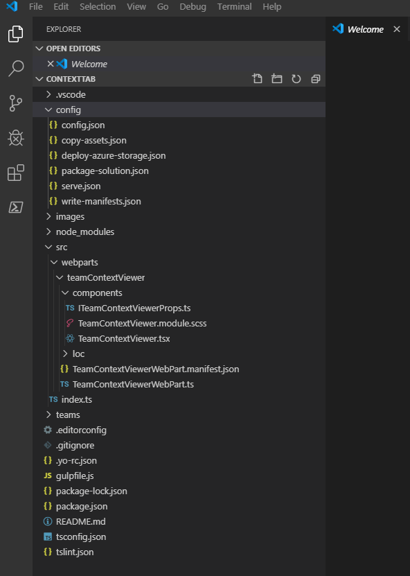
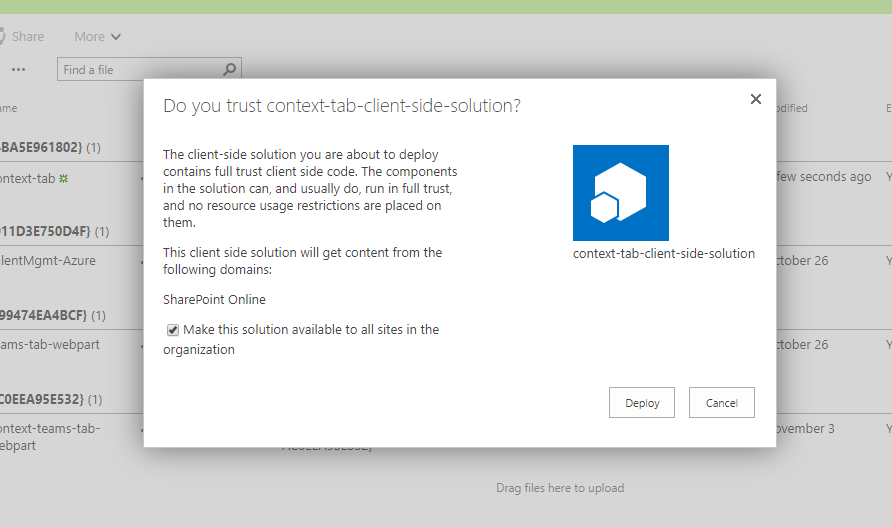
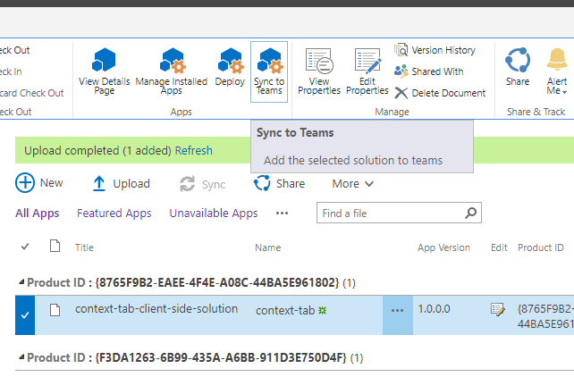
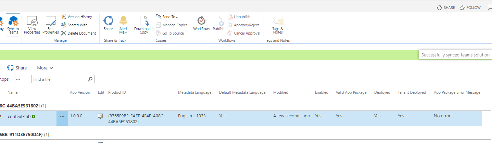
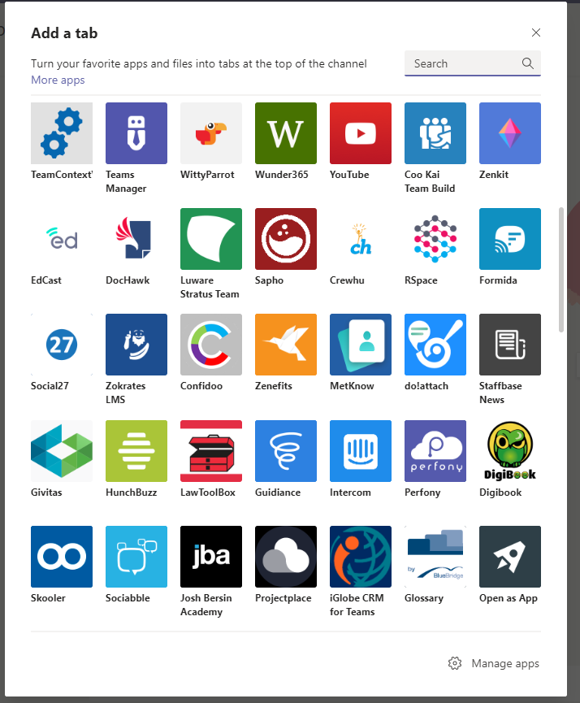
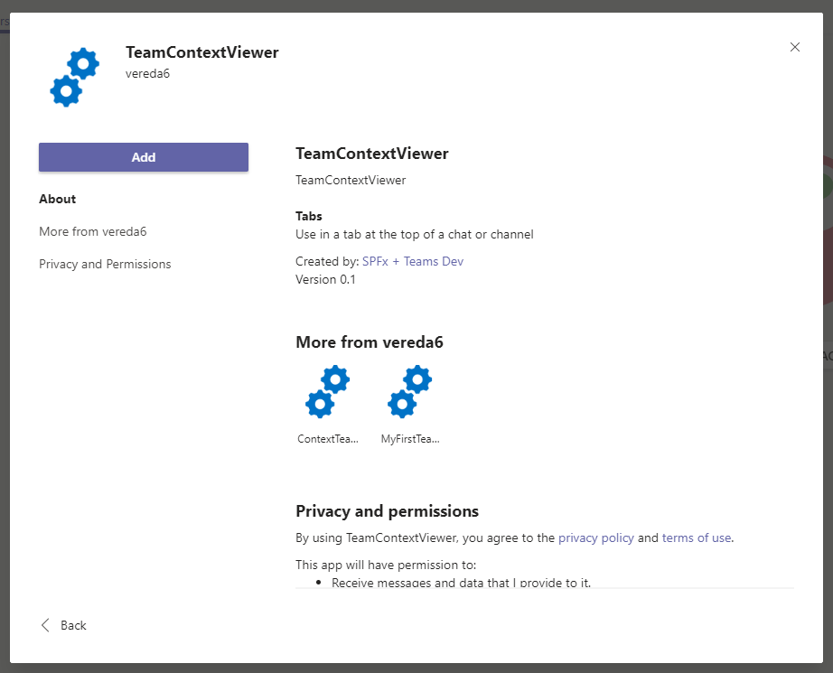
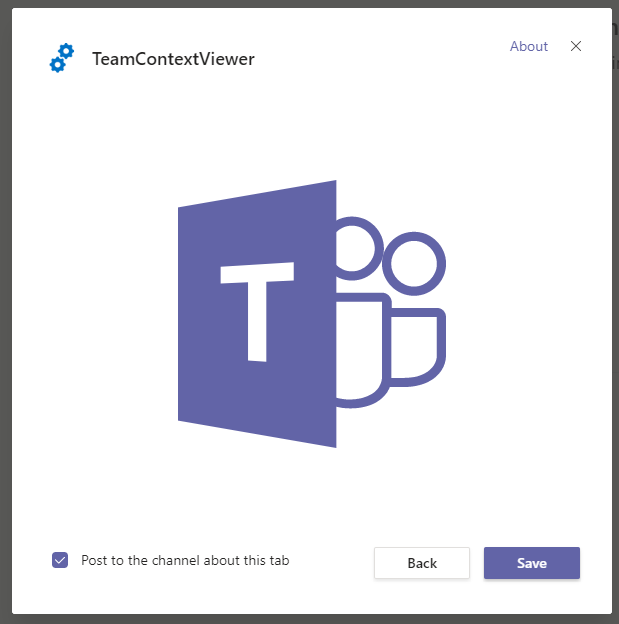
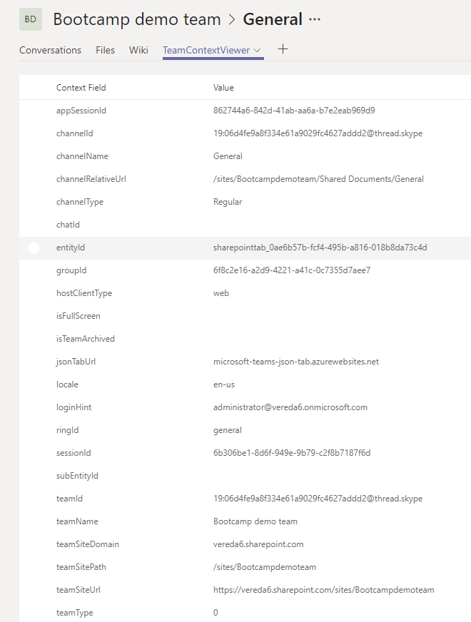

# Teams tab con SharePoint Framework

## Requisitos
Para la realización de este laboratorio necesitaremos lo mismo que necesitariamos para un desarrollo en Spfx más un canal de Teams sobre el que agregar el nuevo tab.

## Creando el proyecto

En primer lugar vamos a crear el proyecto con Yeoman al igual que cualquier otra solución de SharePoint Framework.
Como siempre empezamos ejecutando Yeoman en el directorio que hemos creado previamente donde se almacenará nuestro proyecto:
```bash
yo @microsoft/sharepoint
```

Rellenamos los datos tal y como se ven en la imagen. 



Esperamos a que Yeoman termine de ejecutarse y nos cree toda la estructura del proyecto.

Una vez finalizado el proceso, procedemos a abrir el proyecto con Visual Studio Code:



## Picando código
### Configurando el webpart

Lo primero que debemos hacer es modificar el manifiesto del webpart para habilitar el que funcione en Teams, para ello en la propiedad *"supportedHosts"* añadiremos un nuevo elemento **"TeamsTab"**:
```json
{
  "$schema": "https://developer.microsoft.com/json-schemas/spfx/client-side-web-part-manifest.schema.json",
  "id": "98bf6cd2-be09-4d42-8142-232641d7b2fb",
  "alias": "TeamContextViewerWebPart",
  "componentType": "WebPart",

  // The "*" signifies that the version should be taken from the package.json
  "version": "*",
  "manifestVersion": 2,

  // If true, the component can only be installed on sites where Custom Script is allowed.
  // Components that allow authors to embed arbitrary script code should set this to true.
  // https://support.office.com/en-us/article/Turn-scripting-capabilities-on-or-off-1f2c515f-5d7e-448a-9fd7-835da935584f
  "requiresCustomScript": false,
  "supportedHosts": ["SharePointWebPart", "TeamsTab"],

  "preconfiguredEntries": [{
    "groupId": "5c03119e-3074-46fd-976b-c60198311f70", // Other
    "group": { "default": "Other" },
    "title": { "default": "TeamContextViewer" },
    "description": { "default": "This webpart shows the teams context properties" },
    "officeFabricIconFontName": "Page",
    "properties": {
      "description": "TeamContextViewer"
    }
  }]
}
```

### Primeros pasos

Lo interesante de un desarrollo para Teams en Spfx, es que la apliación pueda interactuar con los elementos que componen el Team o canal donde se está ejecutando. Por lo que en primer lugar debemos saber dónde estamos y para ello debemos cargar el contexto de Teams que no es más que un objeto que contendrá bastante información respecto a donde se está ejecutando.

Para ello comenzamos haciendo un import en TeamContextViewerWebPart.ts:
```typescript
import * as microsoftTeams from '@microsoft/teams-js';
```

A continuación agregamos una variable privada en la clase del webpart:
```typescript
private _teamsContext: microsoftTeams.Context;
```

Para que esa variable se inicialice, implementaremos el método *onInit* del WebPart de la siguiente manera:
```typescript
  protected onInit(): Promise<any> {
    let retVal: Promise<any> = Promise.resolve();
    if (this.context.microsoftTeams) {
      retVal = new Promise((resolve, reject) => {
        this.context.microsoftTeams.getContext(context => {
          this._teamsContext = context;
          resolve();
        });
      });
    }
    return retVal;
  }
```

En este punto si este WebPart se está ejecutando en una pestaña en Teams, en el método *onInit* tendremos un objeto con unas cuantas propiedades con información muy útil de cara a interactuar con el canal.

### Transformando los datos

Los siguientes pasos están encaminados a coger dicha información del contexto y mostrarla en pantalla para que podamos ver de un vistazo qué vamos a encontrar y de qué manera podremos explotarla.

Comenzamos por agregar en el componente *ContextTeamsTab.tsc* el siguiente interfaz:
```typescript
export interface IDetailsListCompactItem {
  key: number;
  name: string;
  value: string;
}
```

A continuación volvemos al WebPart y agregamos el siguiente método privado con el correspondiente *import*:
```typescript
import {IDetailsListCompactItem} from './components/TeamContextViewer'

private getFieldsFromContext(): IDetailsListCompactItem[] {
    let result: IDetailsListCompactItem[] = [];
    let keys: string[] = Object.keys(this._teamsContext);
    for (let i: number = 0; i < keys.length; i++) {
        result.push({ key: i, name: keys[i], value: this._teamsContext[keys[i]] });
    }
    return result.sort((a, b) => (a.name > b.name) ? 1 : -1);
}
```

Este método básicamente lo que va a hacer es transformar todas las propiedades que nos vienen en el objeto contexto en un array de un objetos con un formato sencillo para poder representarlo por pantalla.

Lo siguiente que haremos será pasar como *prop* al componente raíz ese array de datos.

Primero, modificamos *ITeamContextViewerProps.ts* remplazando el contenido con lo siguiente:
```typescript
import {IDetailsListCompactItem} from './TeamContextViewer'

export interface ITeamContextViewerProps {
  fields: IDetailsListCompactItem[]
}
```

Después reemplazamos el método *render* de *TeamContextViewerWebPart.ts* por lo siguiente:
```typescript
  public render(): void {
    const element: React.ReactElement<ITeamContextViewerProps > = React.createElement(
      TeamContextViewer,
      {
        fields: this.getFieldsFromContext()
      }
    );

    ReactDom.render(element, this.domElement);
  }
```
### Mostrando las propiedades del contexto en pantalla

Llegados a este punto lo que vamos a hacer es modificar el componente creado por defecto para que nos muestre un listado con todas las propiedades del contexto. Para ello usaremos de manera sencilla uno de los componenetes de Office Fabric UI.

Comenzamos por realizar el import para poder usar el componente *DetailList* de OFUI:
```typescript
import { DetailsList, DetailsListLayoutMode, SelectionMode, IColumn } from 'office-ui-fabric-react/lib/DetailsList';
```
A continuación agregamos al componente una variable privada, así como un constructor para inicializar dicha variable:

```typescript
  private _columns: IColumn[];

  constructor(props: ITeamContextViewerProps) {
    super(props);

    this._columns = [
      { key: 'fieldNameColumn', name: 'Context Field', fieldName: 'name', minWidth: 100, maxWidth: 200, isResizable: true },
      { key: 'fieldValueColumn', name: 'Value', fieldName: 'value', minWidth: 100, maxWidth: 200, isResizable: true }
    ];
  }
```

Por último, reemplazamos por método render del componente *TeamContextViewer* por el siguiente:
```typescript
  public render(): React.ReactElement<ITeamContextViewerProps> {
    return (
      <DetailsList
        compact={true}
        items={this.props.fields}
        columns={this._columns}
        setKey="set"
        layoutMode={DetailsListLayoutMode.justified}
        selectionMode={SelectionMode.none}
      />
    );
  }
```

## Despleguemos nuestro WebPart

La manera de desplegar este tipo de desarrollo es prácticamente igual a un WebPart normal para Spfx salvo algunas pequeñas diferencias. Comencemos...

Primero empaquetamos la solución:
```typescript
gulp bundle --ship
```
```typescript
gulp package-solution --ship
```

A continuación nos toca desplegar sobre el *Catálogo de aplicaciones*:


Importante que marquemos el check *"Make this solution available to all sites in the organization"*

Una vez desplegado, y con objetivo de tenerlo disponble en Microsoft Teams, es importante seleccionar el paquete y pulsar el botón *"Sync to Teams"*


Si todo hay ido bien obtendremos el mensaje *"Succesfully synced teams solution"*.


## Probemos en Teams

Ha llegado ya el momento de probar nuestro WebPart en Teams como Tab. Creamos un nuevo Team o seleccionamos uno de los que ya tengamos creados.

Pulsamos el símbolo **+** para agregar una nueva pestaña y seleccionamos nuestro WebPart recién creado *TeamContextViewer*:


Nos aparece un popup con información del tab que vamos a agregar, pulsamos sobre el botón *Add*


En la siguiente ventana pulsamos sobre el botón *Save* y si queremos agregar un mensaje al canal avisando de que hemos agregado un nuevo tab dejar seleccionado el check.



Por último se nos muestra el tab con el listado completo con todas las propiedades y sus diferentes valores.



